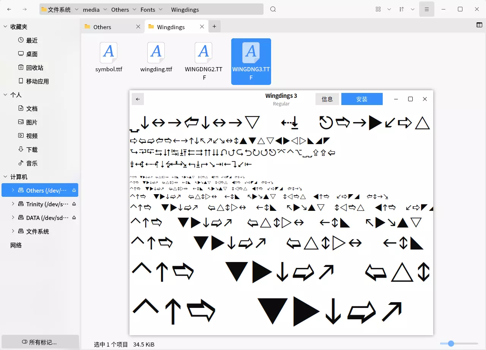
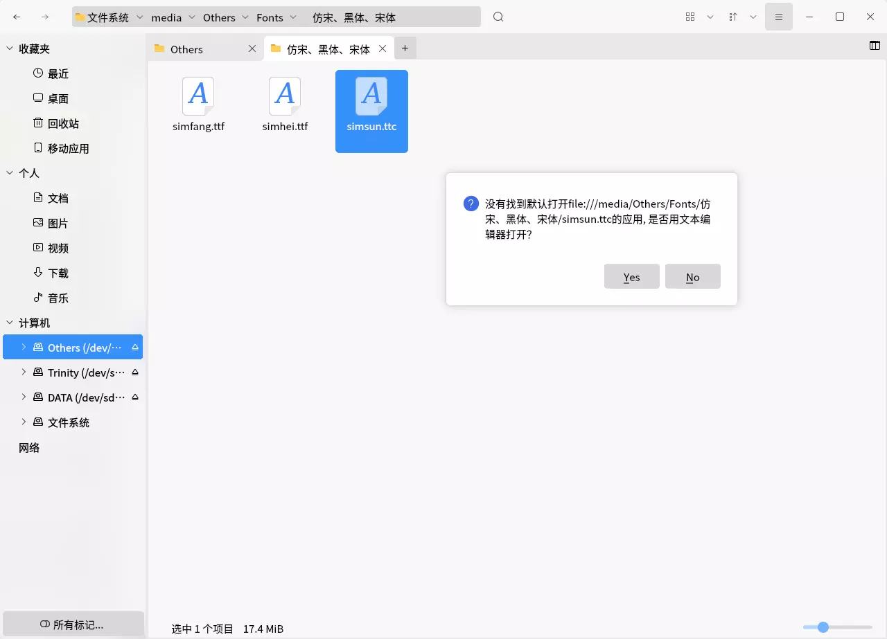
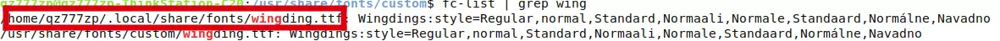

为了防止自己反复折腾，搞一个折腾笔记还是有必要的！本篇笔记会持续更新。

# 安装NVIDIA驱动
众所周知，在Linux操作系统中安装NVIDIA驱动是一件非常麻烦的事情，而且很容易崩溃。下面介绍如何使用官方的RunFile文件进行安装驱动。  
## 准备工作
你需要将驱动程序提前放入到你的电脑中，否则到命令行中复制还得需要挂载或者下载等操作浪费时间。  
安装驱动安装程序所需要的软件：``gcc cmake make``，例如

sudo apt install gcc cmake make


## 禁用Linux通用图形界面驱动nouveau
打开``/etc/modprobe.d/blacklist.conf``文件

sudo nano /etc/modprobe.d/blacklist.conf

在文件的末尾添加
```
blacklist nouveau
options nouveau modeset=0
```
保存后退出，输入指令

sudo update-initramfs -u

更新配置，重启（下列指令都可以重启）

sudo reboot
sudo shutdown -r now

## 安装驱动
重启之后应该无法打开图形界面（通过图形界面登录应该进不去桌面），打开tty超级终端界面进行登录。  
记得给你的驱动程序加执行权限，并运行

chmod a+x ./NVIDIA-Linux-x86_64-xxx.xx.xx.run
sudo ./NVIDIA-Linux-x86_64-xxx.xx.xx.run

剩下的就可以按照安装程序的步骤安装即可。
## 卸载驱动
有的时候驱动会崩掉，``nvidia-smi``中没有显示，需要重新安装一下驱动，此处仍然需要runfile安装文件，执行

sudo ./NVIDIA-Linux-x86_64-xxx.xx.xx.run --uninstall


# 挂载硬盘
挂载硬盘也是一个基本操作，如果你需要通过外部的设备获取文件或数据，简单挂载就可以满足你的要求。但是一些长时间接入的大的硬盘不能总是开机的时候都让你手动挂载吧，有些硬盘还是让他永久挂载一下。
## 手动挂载和解除挂载
先提一下手动挂载。通过``sudo fdisk -l``先看看新接入的盘的具体的设备名称，通常是``/dev/sdXn``的形式。然后执行

sudo mount /dev/sdXn [dir]

其中，后面的参数为一个空目录，但是必须是一个存在的文件夹。解除挂载也很简单

sudo umount /dev/sdXn
or
sudo umount [dir]

两条指令都可以，参数可以是具体的设备名，也可以是具体的挂载点。
## 准备工作
挂载硬盘需要硬盘的UUID信息和文件系统，两个信息可以通过1个指令进行查看

sudo blkid

它会打印出每个分区(partition)的信息，free space不会显示在上面。每条信息都会形如
```
/dev/sdXn: LABEL="xxx" UUID="xxx" TYPE="xxx" ...
```
LABEL有的盘有Label有的盘没有，这取决于你在使用mkfs指令的时候指没指定Label，对于挂载硬盘来说不太需要这个，我们要的是UUID和TYPE，前者就是UUID啦，后者是磁盘的文件系统类型。  
``lsblk -f``指令也可以达到上面命令的效果，而且更直观，你可以根据你的使用习惯来决定使用哪个命令。
## 永久挂载硬盘
编辑``/etc/fstab``文件

sudo nano /etc/fstab

可以看到，所有的硬盘的挂载都写在了这个文件中，包括你的系统盘、swap分区等等。在此处你可以挂载硬盘，包括NTFS文件系统的磁盘也可以挂载。  
具体的格式是
```
<file system> <mount point> <type>  <options> <dump>  <pass>
UUID=xxx  /mnt/xxx  xxx defaults  0 0
```
中间使用空格或者Tab(\t)分隔。具体参数的意思是

|    字段     | 解释                                                                                                       |
| :---------: | ---------------------------------------------------------------------------------------------------------- |
| file system | 要挂载的分区或设备，不要被英文所迷惑                                                                       |
| mount point | 挂载点，说白了你要在哪里访问你的设备                                                                       |
|    type     | 挂载的分区或设备是什么文件系统类型，常见的有ext4、ntfs、auto等                                             |
|   options   | 挂载时的参数，一般使用defaults即可                                                                         |
|    dump     | 该挂载后的文件系统能否被dump备份命令作用，0为不能，1为每天都进行dump备份，2为不定期进行dump备份，一般选择0 |
|    pass     | 开机时是否检查磁盘，0为不检查，1为优先校验（根目录会使用这个），2为校验，一般选择0                         |

执行完成之后进行重启，你的电脑即可自动挂载硬盘。  
**注意！**千万不要写错了，否则进不去系统。我之前曾经把``defaults``少写了一个s，就进不去图形界面了。不过写错了也不要担心，系统如果发现这个文件发生了错误，只要你的根目录挂载没问题，他就会进入到超级终端中，允许你再次更改fstab文件。  
## P.S.: 为磁盘分区并格式化成想要的文件系统类型
如果你的磁盘都是free space的话，挂载是挂载不了的，就相当于Windows中的Disk Manager（磁盘管理）中显示未分配是一样的效果。所以使用指令分区是一项重要的技能。  
那么如何分区呢？使用强大的``fdisk``指令吧！  
我们都知道，看磁盘信息一个重要的指令就是``sudo fdisk -l``，那么这个指令也可以用于分区。直接输入

sudo fdisk /dev/sdX

其中，``sdX``是你的具体的设备名称，可以通过``sudo fdisk -l``指令进行查看。  
在新的界面中，按m加回车可以看到每一个小指令的介绍，这里只介绍最基本的分区操作：将整个盘分成1个区。  
输入n和回车进入到新建分区中，再选择主分区（输入p和回车），输入1和回车，再输入两次回车（默认的设置）即可设置完成一个盘的一个分区的建立。  
当然还没有完成，因为这只是规划了一下，并没有实际应用。因此你仍然需要输入w和回车进行应用更改，然后``fdisk``就会帮助你进行应用更改。  
建完了分区就算搞定了吗？并不是，这里与Windows不同，Windows通过磁盘管理可以直接一步到位，Linux中是将这个过程拆成了两个。现在使用强大的``mkfs``指令进行创建文件系统的工作吧！
你如果不熟悉mkfs指令的操作，可以输入``man mkfs``来看一下这个操作。其实很简单

sudo mkfs -t [type] /dev/sdXn

``[type]``处写你想要的文件系统类型，``sdXn``为你要格式化的分区。举个例子吧：

sudo mkfs -t ext4 /dev/sdb1

当然你可以将上面的命令简单简写为

sudo mkfs.ext4 /dev/sdb1

也是一样的。  
## P.S.: 使用exFAT文件系统
文件配置表（File Allocation Table，FAT）是微软发明的一种文件系统类型，Windows和Linux均支持，可用于跨操作系统传输文件。经典的FAT有FAT16、FAT32，缺点就是占用空间大，容易产生文件碎片，磁盘读写效率会比较低。  
如果需要长时间跨越操作系统操作，那么选用FAT文件系统是很不错的选择。但是常见的FAT32不支持单个文件大小超过3.6G，因此exFAT(FAT64)孕育而出。  
Linux在内核5.4版本的时候支持了exFAT文件系统，如果用不了，需要下载软件包。在Debian/Ubuntu环境中可以执行命令来下载

sudo apt install exfat-fuse exfat-utils

这样你可以访问并创建exFAT文件系统了，也就是说你可以使用``mkfs.exfat``进行格式化了。  
这里**不建议**把大硬盘格式化成exFAT，因为会导致许多文件碎片。  
# CUDA的设置
如果你安装了多个CUDA，你需要指定具体的CUDA版本，否则通过``nvcc -V``是没法看到CUDA信息的。配置起来很简单。  
## 修改BASH配置文件
如果你的Shell使用的是BASH（一般都是默认使用bash）则在你的用户文件夹下面可以看到``.bashrc``文件，用你最喜欢用的文本编辑器打开

nano .bashrc

在最后添加以下字段
```
export PATH=/usr/local/cuda/bin${PATH:+:${PATH}}
export LD_LIBRARY_PATH=/usr/local/cuda/lib64${LD_LIBRARY_PATH:+:${LD_LIBRARY_PATH}}
export CUDA_HOME=/usr/local/cuda
```
具体的路径需要你自己看一下，一般来说CUDA都会安装在/usr/local下，/usr/local/cuda通常是一个软链接。  
保存并退出之后需要使用``source .bashrc``应用设置，或者重新进入Shell。
## 修改Fish配置文件
如果你的Shell使用的是Fish，则在你的用户文件夹下面新建``.config/fish/config.fish``文件，并加入
```
set PATH /usr/local/cuda/bin $PATH
set LD_LIBRARY_PATH /usr/local/cuda/lib64 $LD_LIBRARY_PATH
set CUDA_HOME /usr/local/cuda
```
这几条命令和BASH配置文件中的意思是一样的。同样你需要应用设置，``source .config/fish/config.fish``，或者重新进入Shell。
## 在虚拟环境中（venv）修改对应配置文件
事实上，虚拟环境的激活实际上是和``.bashrc``与``.config/fish/config.fish``一样的。在你通过virtualenv新建好环境之后进入到``bin``文件夹下。通过ls指令你可以看到一堆以**activate**开头的文件。其中，``activate``文件为Bash配置文件，``activate.fish``文件为Fish配置文件，``activate.ps1``文件为Powershell配置文件等等。如果想要在虚拟环境中使用CUDA，参照上述两个小节中的内容对Shell的对应配置文件进行修改即可。  
# 共享文件服务Samba 1.0的设置
现在有些老的NAS服务器仍然使用**不安全的**Samba 1.0服务，但是现在的大多数操作系统已经默认关闭，所以我们必须要打开才能够访问共享服务器。  
经过测试，Ubuntu 18.04及以上都是可以使用这个方法的。首先你需要确保安装了Samba服务，否则配置了半天也没啥用  

sudo apt install samba

正常安装完毕之后应该可以通过命令``sudo systemctl status smbd.service``来查看Samba服务运行状态。  
使用你最拿手的Linux文本编辑器，打开文件``/etc/samba/smb.conf``并找到``[global]``标签，在这标签下面输入
```
ntlm auth = ntlmv1-permitted
client min protocol = NT1
```
使其变成
```
[global]
...
   ntlm auth = ntlmv1-permitted
   client min protocol = NT1
...
```
保存退出之后使用``sudo service smbd restart``重启服务即可。  
# "rc-local"与开机自启动的那点事
自从Ubuntu在18.04之后默认关闭了开机自启动脚本服务，我就一直有开机自启动的需求。在抛弃了KDE neon、拥抱Ubuntu Kyrin之后，正式折腾了一遍``rc-local``服务...（其实之前也折腾过但是每次都忘了总结）
## 前期准备
- 要准备好进行开机自启动的文件们
- Ubuntu 18.04及以上

## 开启自启动服务
其实Ubuntu并没有删除自启动服务，而是关闭了这项功能，因此只需要手动开启即可。使用你最擅长的文本编辑器编辑``rc-local.service``文件，并在最后加入三行：

# open service file
sudo nano /lib/systemd/system/rc-local.service
# insert
[Install]
WantedBy=multi-user.target
Alias=rc-local.service

将该文件复制或链接到系统服务文件夹

sudo ln -s /lib/systemd/system/rc-local.service /etc/systemd/system/rc-local.service

## 设置开机启动脚本
下一步根据shell脚本的语法规则修改``rc.local``文件即可。

sudo nano /etc/rc.local

注意一下，系统会在开机的某一个步骤时执行该脚本，使用的则是root用户登录的，建议这里的文件调用使用绝对路径。

后续如果想看服务是否正常运行，可以通过``systemctl``或者``service``指令进行查看。**注意**：服务名称叫做``rc-local``，中间的是减号。

sudo service rc-local status

# 安装字体
Linux安装字体的方式有主要两种：

- 使用GUI的：可以直接双击字体文件进行安装
- 使用命令行安装：一键三连

## GUI方式
GUI方式很简单，双击字体文件，点击安装即可，如下图所示。



但是该安装方法会安装在对应的用户下，而且可能不支持一些字体文件扩展名，例如ttc，如下图所示。



你可以通过执行``fc-list``和检索命令来查看字体的安装位置，如下图所示。



## 命令行方式
为你的字体们创建一个全新的文件夹，该文件夹应该位于``/usr/share/fonts/``下：

sudo mkdir /usr/share/fonts/custom


将你的字体全部复制到该文件夹下，然后执行“一键三连”即可。

sudo mkfontscale
sudo mkfontdir
fc-cache


如此安装的字体所有用户都可以使用。
# Anaconda & Miniconda 多用户配置
有些时候需要多用户的Anaconda或者Miniconda，但是网上的一些教程不太全，因此这里补全一下。
## 安装conda
Anaconda和Miniconda的过程是一样的，因此这里只用Miniconda举例。

使用root用户（或者sudo）执行脚本，在安装位置的时候选择一个公共的位置安装，例如``/opt/miniconda3``

sudo sh miniconda3.sh

## 设置权限以及用户组
设置用户组的原因是为了：

- 防止其他用户直接在公共目录下的环境中建立虚拟环境
- 防止其他用户直接修改
- 防止其他程序修改

新建一个用户组，并将对应用户、文件以及文件夹加入到这个组中

sudo groupadd conda
sudo usermod -aG conda [username]
sudo chgrp -R conda /opt/miniconda3
sudo chmod 770 -R /opt/miniconda3
sudo chmod g+s /opt/anaconda
sudo chmod g+s `find /opt/anaconda -type d`
sudo chmod g-w /opt/miniconda3/envs

g+s是在设置组继承，g-w是关闭读权限。
## 具体用户修改
此时其他用户是无法新建虚拟环境的，原因是因为在``conda config``中输出的``envs_dirs``默认排在第一位的是安装目录下的envs文件夹，而这个文件夹刚刚被我们设置了无写权限，所以并不直接创建虚拟环境。因此仍然需要做一些设置。

在**对应的用户Shell环境下**执行下面的语句进行初始化

source /opt/miniconda3/bin/activate
conda init
conda config --add envs_dirs ~/.conda/envs

我也写了一段脚本，可以把这段放到一个sh文件中。

#!/bin/bash
# make sure you have added this user to conda group
if [ -n "$1" ]; then
    source $1/bin/activate
else
    source /opt/miniconda3/bin/activate
fi

conda init
conda config --add envs_dirs ~/.conda/envs

这个脚本允许输入一个含有安装地点的参数来设置。现在只需要执行这个脚本（假设命名为``initconda.sh``）即可

sudo -u [user] bash initconda.sh

这样就可以在有sudo权限的用户下统一设置了。
# Linux常用指令
该部分放一下常用的一些指令的讲解，结尾会有一个（我常用的）指令大列表。
## 定时执行——at指令
在某些应用场景下，定时执行某项任务是非常有必要的。at指令因此而来，它可以根据时刻到点执行指令。这里大多数都是直接借用[别人写的](http://c.biancheng.net/view/1090.html)教程，感谢这位老哥

### 用前准备
at指令需要安装，据我所知Ubuntu 16.04安装后并没有提供at服务，因此建议查看一下是否安装了，并且看一下服务是否正在运行。

sudo apt install at
sudo service atd status


### 运行指令
at指令的操作很简单，输入``at [option] [time]``即可开始编辑一个at指令。看一下at的命令选项。

|   选项    | 含义                                                                     |
| :-------: | ------------------------------------------------------------------------ |
|    -m     | 当 at 工作完成后，无论命令是否输出，都用 E-mail 通知执行 at 命令的用户。 |
| -c <jobs> | 显示该 at 工作的实际内容。                                               |
| -t <time> | 在指定时间提交工作并执行，时间格式为 [[CC]YY]MMDDhhmm。                  |
|    -d     | 删除某个工作，需要提供相应的工作标识号（ID），同 atrm 命令的作用相同。   |
|    -l     | 列出当前所有等待运行的工作，和 atq 命令具有相同的额作用。                |
|    -f     | 脚本文件 	指定所要提交的脚本文件。                                       |

时间格式如下表

|              格式              | 用法                                                                                         |
| :----------------------------: | -------------------------------------------------------------------------------------------- |
|             HH:MM              | 比如 04:00 AM。如果时间已过，则它会在第二天的同一时间执行。                                  |
|    Midnight<br>（midnight）    | 代表 12:00 AM（也就是 00:00）。                                                              |
|        Noon<br>（noon）        | 代表 12:00 PM（相当于 12:00）。                                                              |
|     Teatime<br>（teatime）     | 代表 4:00 PM（相当于 16:00）。                                                               |
|       英文月名 日期 年份       | 比如 January 15 2018 表示 2018 年 1 月 15 号，年份可有可无。                                 |
| MMDDYY<br>MM/DD/YY<br>MM.DD.YY | 比如 011518 表示 2018 年 1 月 15 号。                                                        |
|            now+时间            | 以 minutes、hours、days 或 weeks 为单位，例如 now+5 days 表示命令在 5 天之后的此时此刻执行。 |

我一般只用最后一个now+时间的格式，因为我所遇到的场景都是前面需要处理完成之后再执行，例如

at now+5 hours

输完对应指令后按Ctrl+D（即输入EOF）后结束at任务编辑，并会在命令行上打印出啥时候执行该at任务。

两个管理at任务的指令：atq和atrm。atq命令用于查看当前等待运行的任务，atrm命令后者用于删除指定的任务。

## 实时刷新——watch指令
watch指令用于实时刷新某些无法实时刷新的指令，例如nvidia-smi、netstat -ant。

使用很简单：``watch [-n num] [-d] [-t]``

| 命令选项 | 描述                                                                  |
| :------: | --------------------------------------------------------------------- |
|  -n num  | 每几秒运行一下程序，与--interval相同                                  |
|    -d    | 高亮显示变化的区域，与--differences相同                               |
|    -t    | 关闭watch命令在顶部的时间间隔、命令、当前时间的输出，与--no-title相同 |

## 指令大列表
这是我自己排的操作类型，不一定准确~

|          指令           |     类型     | 示例                                                             | 解释                                                                     |
| :---------------------: | :----------: | ---------------------------------------------------------------- | ------------------------------------------------------------------------ |
|           man           |   帮助操作   | man [instruction]                                                | 看指令的说明文档                                                         |
|           ls            |  文件夹操作  | ls [dir]                                                         | 查看对应目录中的内容，不写[dir]字段默认为当前目录                        |
|           ll            |  文件夹操作  | ll [dir]                                                         | 等同于ls -l                                                              |
|           la            |  文件夹操作  | la [dir]                                                         | 等同于ls -a                                                              |
|           mv            |   文件操作   | mv (-T) [file or folder]                                         | 移动或重命名文件或文件夹                                                 |
|           cp            |   文件操作   | cp (-T -r) [file or folder]                                      | 复制文件或文件夹，文件夹需要加-r                                         |
|           rm            |   文件操作   | rm (-rf) [fire or folder]                                        | 删除文件或文件夹，文件夹需要加-r，-f为强制删除                           |
|           du            |  文件夹操作  | du -h [dir]                                                      | 查看子文件夹下的文件大小                                                 |
|           df            |   磁盘操作   | df -h                                                            | 看磁盘占用                                                               |
|           cd            |  文件夹操作  | cd [dir]                                                         | 转到具体的文件夹内                                                       |
|           cat           |   文件操作   | cat [file]                                                       | 将文件打印在终端中                                                       |
|          less           |   文件操作   | less [file]                                                      | 查看文件，按q退出                                                        |
|    vi<br>vim<br>nano    |   文件操作   | vi/vim/nano [file]                                               | 均为文本编辑器（vim一般需要安装）按照使用习惯使用                        |
|          fdisk          |   磁盘操作   | fdisk -l                                                         | 磁盘分区、查看磁盘信息等                                                 |
|          mkfs           | 文件系统操作 | mkfs.xxxx [partition]                                            | 创建文件系统                                                             |
|          sftp           |   远程操作   | sftp [user]@[host]                                               | SFTP安全文件传送协议，通常使用22端口（与SSH一样）有一套自己的指令        |
|          free           |   内存操作   | free -m/-g/-h                                                    | 查看内存使用情况，-m为以MB为单位，-g为以GB为单位，-h为自动选取单位       |
|           top           |   任务操作   | top                                                              | 任务管理器，实时更新                                                     |
|           ps            |   任务操作   | ps -A<br>ps aux                                                  | 查看当前所有的任务，可以看到具体的执行的命令和参数，结合grep指令可以筛选 |
|           pwd           |  文件夹操作  | pwd                                                              | 查看当前目录的完整路径                                                   |
| chmod<br>chown<br>chgrp |   文件操作   | chmod a+x [file]<br>chown [owner] [file]<br>chgrp [group] [file] | 修改文件权限；修改文件所有者；修改文件所有组                             |
|          chsh           |   用户操作   | chsh -s [shell] [user]                                           | 修改用户默认Shell                                                        |
|          mkdir          |  文件夹操作  | mkdir [dir]                                                      | 创建新文件夹                                                             |
|         passwd          |   用户操作   | passwd [user]                                                    | 修改用户密码                                                             |
|        shutdown         |   系统操作   | shutdown now                                                     | 关机操作，-r为重启，加now为立即执行                                      |
|           at            |   指令操作   | at now+5 hours                                                   | 定时执行某项任务                                                         |
|          watch          |   指令操作   | watch nvidia-smi                                                 | 重复执行某指令并自动刷新命令行                                           |
