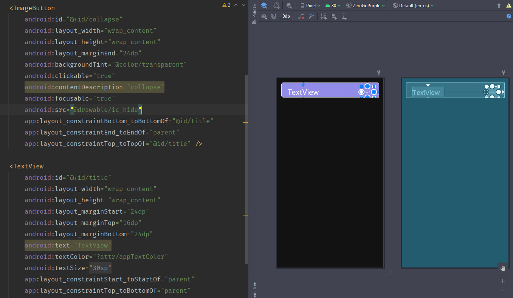
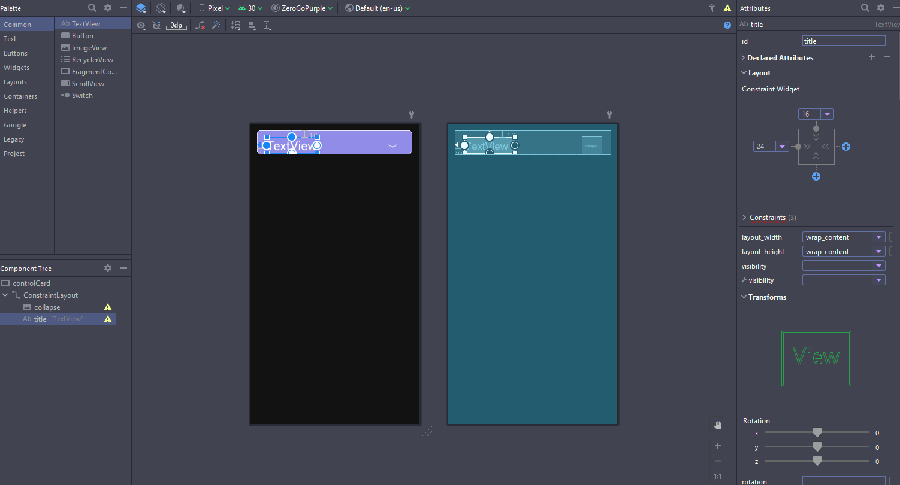
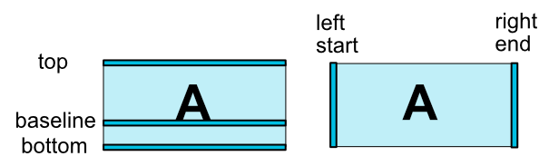
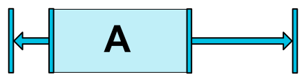
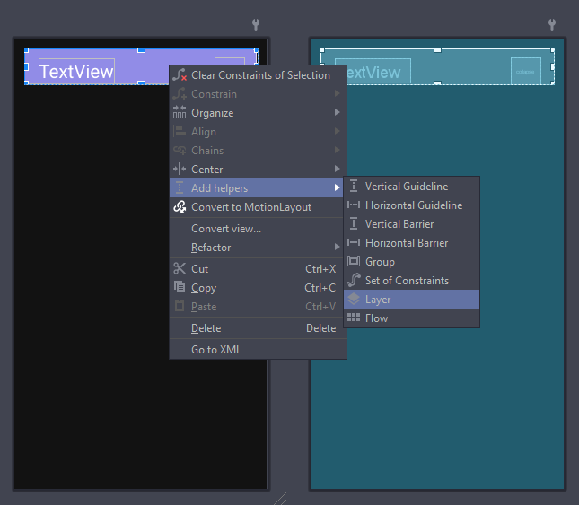
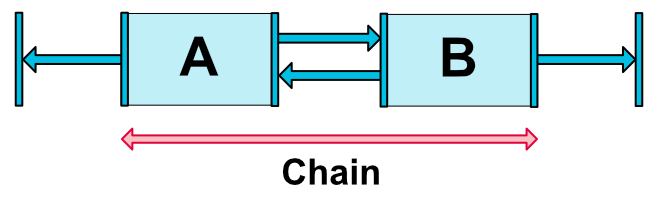
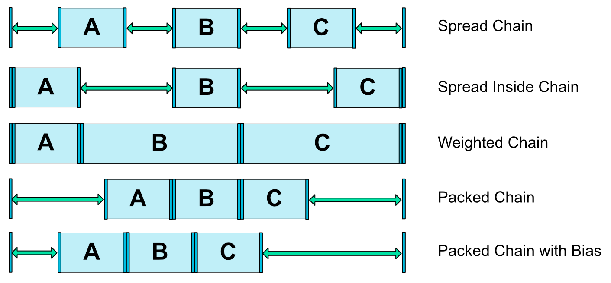

忘记了从什么时候开始，Android Studio默认将ConstraintLayout作为默认布局。你每新建一个layout xml，它都会出现。好用吗？我们来看看。
# 直接放置组件
之前说过，这是有史以来第一次Android实现了拖动放置模块，也就是说你可以在xml的Design页面中将组件直接拖进去，稍作设置即可。如果是以前的话，你可能会使用LinearLayout进行各种设置：orientation必不可少，稍微高级一点还可以用到layout_weight。可是，这些你都得手动输入，或者在右侧面板里去找属性。  
现在，如果你使用ConstraintLayout，你可以通过左侧的选取上下左右跟谁设置相对位置，右侧选择距离是多少就搞定啦！

图2-1 ConstraintLayout编辑界面

图2-2 ConstraintLayout组件编辑界面

# 代码微调
如果你在拖动组件上出现了问题（比如有的时候拖不过去，或者不能正确Constraint），你就需要进行代码上的微调。  
看代码其实很简单，所有有关Constraint的组件都以``app:xxx``的形式出现在组件属性里，你需要在xml最上面引用 

xmlns:app="http://schemas.android.com/apk/res-auto"

在ConstraintLayout中，所有用于限制组件位置的属性都以``app:layout_constraint``开头，后面紧接着的是**组件的哪个位置**和**其他组件的哪个位置**进行**对齐**。例如：``layout_constraintTop_toBottomOf``的意思是说这个组件的顶边和等号后面的组件的底边对齐；``layout_constraintStart_toEndOf``的意思是说这个组件的起始边和等号后面的组件的尾边对齐。当然你也可以使用Left和Right，这样就是左边和右边，但是在RTL（右向左，多出现在阿拉伯文中）的布局中会出现问题。所以，根据这样的限制之后，如果长宽的确定的情况下，就可以只通过两个constraint属性固定住一个组件。

图2-3 几个重要的边 图源自Android官网

还有一个概念叫作**偏移(bias)**，在上下或者左右已经constraint之后可以加入偏移这个属性，它允许你放在一定比例的位置，比如图7中的这样，设置``layout_constraintHorizontal_bias``或者``layout_constraintVertical_bias``为0.3，它就会出现在30%的位置上。

图2-4 偏移 图源自Android官网

但是，我们需要考虑一个问题：大家都知道组件的长宽``layout_width``和``layout_height``两个属性是有两个常规取值的（wrap_content和match_parent），但是如果我想让边界不超过一个组件的边界，但是又想让他充满剩余空间，那怎么办呢？  
ConstraintLayout为我们提供了一个新的值：match_constraint。其实这个值写在xml里就是0dp，只不过你可以在图5的ConstraintLayout组件编辑界面右侧的属性列表中看到这个值。这个值的意思是让你规定的Constraint约束条件来确定组件的长宽。如果你确定要设置这个值，一定要对两条边都要设置constraint属性。如果是长为0dp那么就是``layout_constraintStart``和``layout_constraintEnd``，如果是宽为0dp那么就是``layout_constraintTop``和``layout_constraintBottom``。  
对了，有一条边很重要，那就是**parent**，这个是整个ConstraintLayout的边界，如果你跟这个对齐就是跟最外侧的那个边进行对齐。说白了，你至少有一个组件是要用到parent的，否则整个constraint是不会起效果的。  
剩下的就是自己设置Margin和Padding了，来保证各个组件之间有一定的距离。  
还有一些特殊的constraint方法，例如**baseline**以及**circle**等等，我目前的应用场景还没有用过，等我自己先研究一下之后再写进来。
# 进阶玩法
你以为这就完了吗？还有一些很有意思的东西没有说到。
## Helpers
在设计界面中右键空白处可以看到有一个「Add helpers」，这是ConstraintLayout提供的一些辅助的东西。例如里面的Guideline辅助线，屏障barrier，组Group等等。

图2-5 Helpers

简单说一下这几个，这几个我自己的话是没有用过的，后续如果我自己用过还会在此更新我自己用过后的体会。  
Barrier的应用场景是为了处理多个不等长的组件在其后面进行constraint的情况，它可以在多个控件的一侧建立一个屏障。  
Guildline就是辅助线，不会在App中显示，你需要给它指定位置。  
Group可以将多个组件打包，可以对他们执行同一种操作，例如隐形。  
Placeholder（占位符）可以让一个组件移动到其所在的位置上。
## Chain
这可能是我用的最多的东西了。  
平常我总是能遇到一个很重要的问题：比例分配空间。在LinearLayout中，可以设置``layout_width``为0，使用权重``layout_weight``进行几等分划分。

图2-6 链 图源自Android官网

在ConstraintLayout上，官方提供了一个叫作chain的东西，比LinearLayout的高级了很多。你可以将好几个组件在同一个轴上合在一起形成一条链（Chain）。这个链可以切换不同的形态（具体的属性名称为``layout_constraintHorizontal_chainStyle ``和``layout_constraintVertical_chainStyle``），例如距离等宽、最边上两个组件贴边其他距离等宽、权重分配宽度、合并和带偏移的合并。是不是比LinearLayout强大多了？

图2-7 链的形态 图源自Android官网

